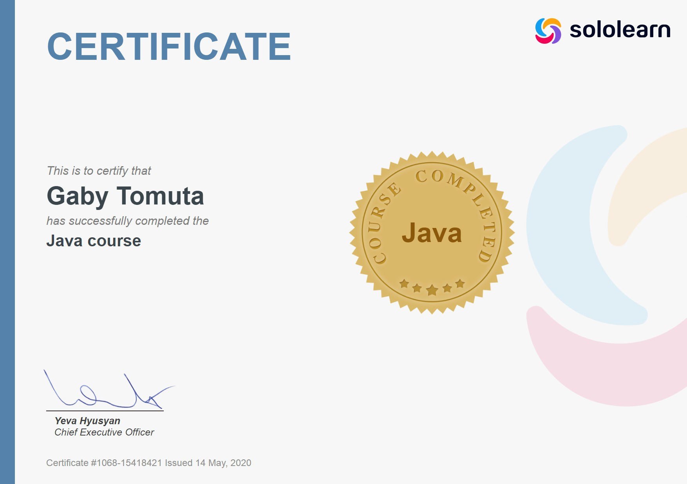

# Sololearn
 = Insert description =
## General information
 - You can find this on [browser](https://www.sololearn.com/), [Google Play](https://play.google.com/store/apps/details?id=com.sololearn&hl=en&gl=US) or [App store](https://apps.apple.com/us/app/sololearn-learn-to-code-apps/id1210079064)
 - Here is my [profile](https://www.sololearn.com/profile/15418421)
## Certificates

 
