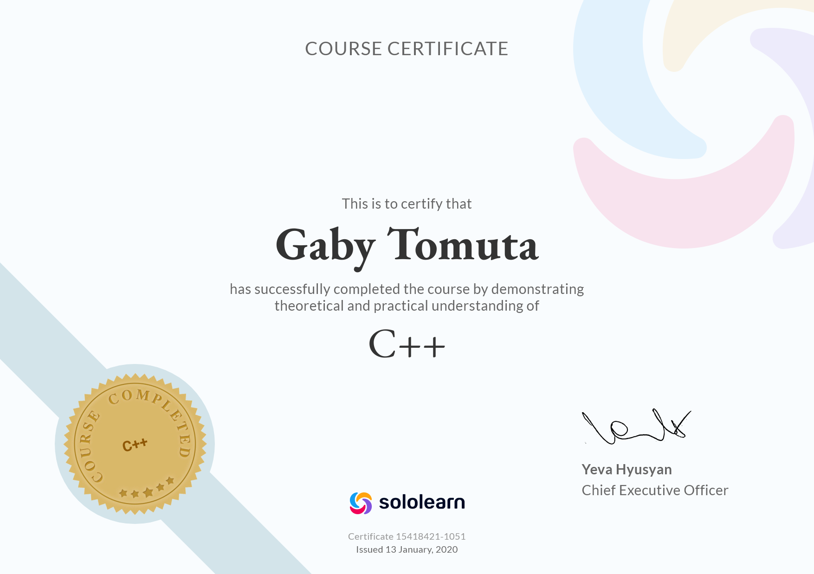
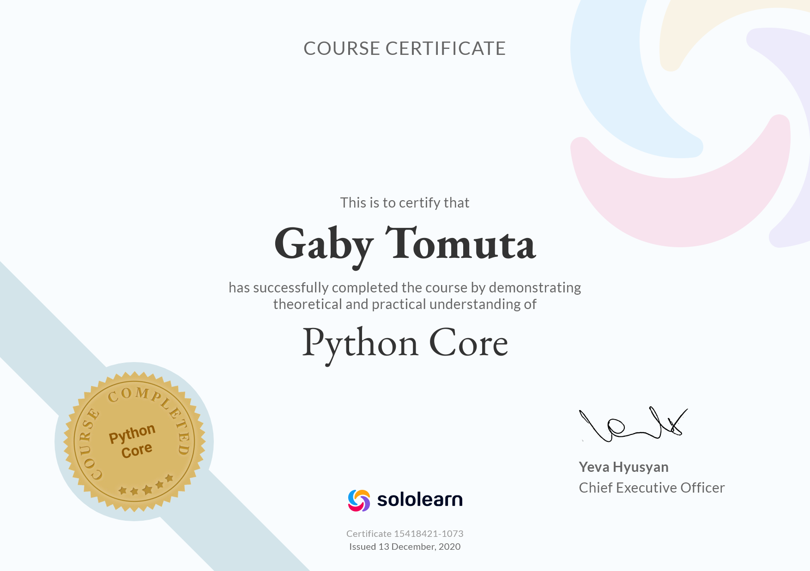
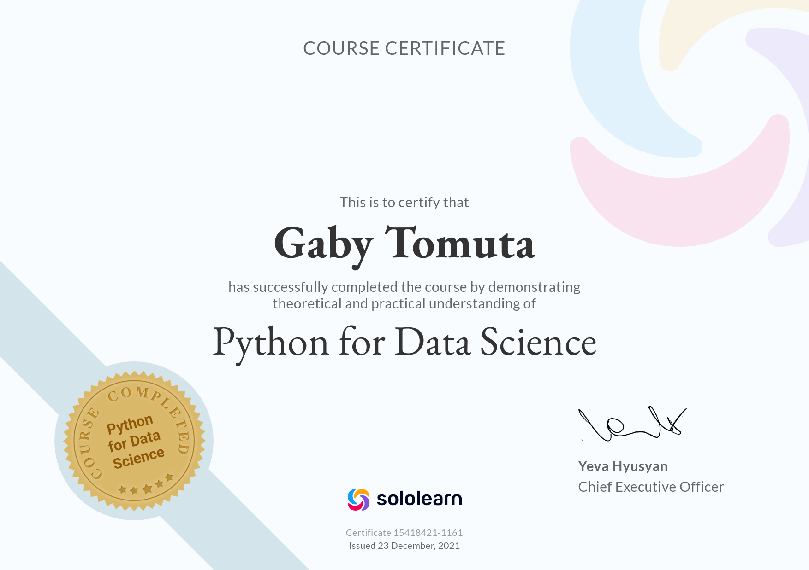

# Sololearn
Sololearn is an app that offers a variety of ways to start and advance in the field of programming, with a great community, competitive challenges, many problems and additional lessons made by the users including Cryptography, Python NumPy, Design Patterns, Git and more.

The languages that you can find in here are: C, C#, C++, Java, Python, Javascript, SQL, HTML, CSS, PHP, Sqift 4, jQuery, Ruby, react + Redux, Web Design, Angular + NestJS, Kotlin and more
## Links
 - You can find Sololearn on [web](https://www.sololearn.com/), [Google Play](https://play.google.com/store/apps/details?id=com.sololearn&hl=en&gl=US) or [App store](https://apps.apple.com/us/app/sololearn-learn-to-code-apps/id1210079064)
 - Here is my [profile](https://www.sololearn.com/profile/15418421)
## Some of my certificates
|                          |                          |
:-------------------------:|:-------------------------:
 | 
 | 
 |  

